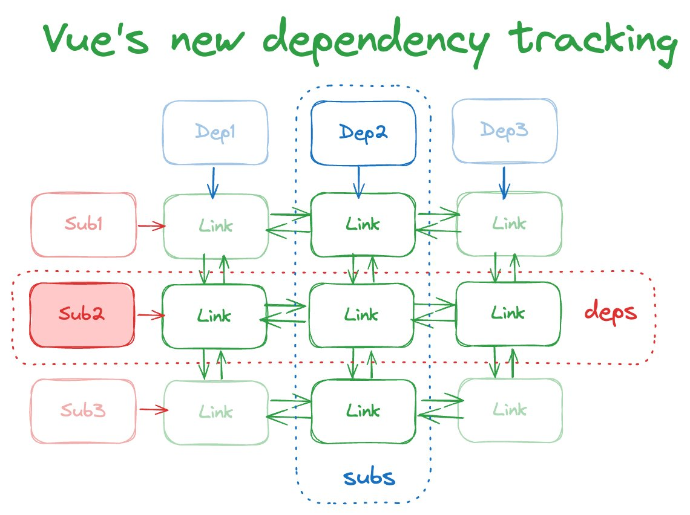

### packages/reactivity/src/effect.ts
1.activeEffect 修改为 activeSub
2.DebuggerOptions、ReactiveEffectRunner不变，挪动了位置
3.ReactiveEffectOptions只包含 scheduler、allowRecurse、onStop，（TODO：其他删除了）
4.新增 EffectFlags (TODO: 作用？？)
```typescript
export enum EffectFlags {
  ACTIVE = 1 << 0,
  RUNNING = 1 << 1,
  TRACKING = 1 << 2,
  NOTIFIED = 1 << 3,
  DIRTY = 1 << 4,
  ALLOW_RECURSE = 1 << 5,
  NO_BATCH = 1 << 6,
}
```
5.新增 Subscriber 类型，用于定位和追踪依赖列表
```typescript
export interface Subscriber extends DebuggerOptions {
  /**
   * Head of the doubly linked list representing the deps
   * 依赖双链表的头部
   * @internal
   */
  deps?: Link
  /**
   * Tail of the same list
   * 同一列表尾部
   * @internal
   */
  depsTail?: Link
  /**
   * @internal
   * TODO：作用
   */
  flags: EffectFlags
  /**
   * @internal
   * TODO：作用
   */
  notify(): void
}
```
6.新增链表节点
```typescript
export interface Link {
    // 节点对应的依赖对象
  dep: Dep
    // 节点对应的订阅对象
  sub: Subscriber

  /**
   * - Before each effect run, all previous dep links' version are reset to -1
   * - During the run, a link's version is synced with the source dep on access
   * - After the run, links with version -1 (that were never used) are cleaned
   *   up
   *   在 effect 运行前，所有'之前的'依赖链版本会重置为 - 1，
   *   在运行期间，一个链的版本会随着dep依赖源的访问同步
   *   在运行之后，所有版本为 - 1 的依赖会被清理，即没有被访问
   */
  version: number
    
  /**
   * Pointers for doubly-linked lists
   * 这是一个二维的链结构，每个link 节点都指向
   * deps、sub、
   */
  nextDep?: Link
  prevDep?: Link

  nextSub?: Link
  prevSub?: Link

  prevActiveLink?: Link
}
```
7. ReactiveEffect 对象变化
7.1）deps 由数组边为链一个link节点、scheduler从构造器中变为对象属性
7.2）新增depsTail、flags、nextEffect


根据海老师提供的图，我们可以判断 sub，订阅者，实际上就是一个个 ReactiveEffect 对象，它代表者订阅依赖，并触发依赖的追踪和接受依赖触发执行（即执行fn）


## ref 初始化收集依赖流程
const a = ref(1), ref 内部会创建一个 ref 实例对象 RefImpl， RefImpl 在构造函数中会初始化一个 dep 对象，
并在访问 a 时，将访问的函数作为依赖，调用 this.dep.track() 收集，
```typescript
 it('should be reactive', () => {
    const a = ref(1)
    let dummy
    const fn = vi.fn(() => {
        dummy = a.value
    })
    effect(fn)
    expect(fn).toHaveBeenCalledTimes(1)
    expect(dummy).toBe(1)
    a.value = 2
    expect(fn).toHaveBeenCalledTimes(2)
    expect(dummy).toBe(2)
    // same value should not trigger
    a.value = 2
    expect(fn).toHaveBeenCalledTimes(2)
})

```
当设置 a 时，即触发 RefImpl 上的 set 方法，其内部会 触发 dep 的 this.dep.trigger() 方法进行触发
最终效果时自动执行了 fn。  
那么我们来看一下 dep 是什么东西。
当ref构造函数执行时，实际上 dep已经初始化了，这个 dep 对象包含这些内容
 ````
computed = undefined
version = 0
activeLink = undefined
subs = undefined
track: () => {}
trigger: () => {}
notify: () => {}
 ````
但这只是初始化，其真正的数据结构（二维双向链表）还没有建立，但是当 effect 执行 fn 触发 ref 的 get 方法时，
在执行完this.dep.track()方法后, this.dep 却发生了变化，那我们看看从 effect 执行，到 this.dep.track() 执行之间，
究竟做了什么。
执行effect，这个函数其实没有太多变化，那我们进一步观察 ReactiveEffect 对象的改动变化，它新增了这几个属性  
```typescript
class ReactiveEffect {
    /**
     * @internal
     */
    deps?: Link = undefined
    /**
     * @internal
     */
    depsTail?: Link = undefined
    /**
     * @internal
     */
    flags: EffectFlags = EffectFlags.ACTIVE | EffectFlags.TRACKING
    /**
     * @internal
     */
    nextEffect?: ReactiveEffect = undefined
}
```
从 effect 的逻辑中看出 在初始化 ReactiveEffect 对象时，构造函数并没有什么太多动作
此时我们的到 effect 的属性如下, 其中 flags 为 5 表示这个 ReactiveEffect 是活动的或正在追踪
```typescript
export enum EffectFlags {
    ACTIVE = 1 << 0,
    RUNNING = 1 << 1,
    TRACKING = 1 << 2,
    NOTIFIED = 1 << 3,
    DIRTY = 1 << 4,
    ALLOW_RECURSE = 1 << 5,
    NO_BATCH = 1 << 6,
}

deps = undefined
depsTail = undefined
flags = 5
nextEffect = undefined
scheduler = undefined
```
继续往下， 我们执行 e.run, 那么看看 run 方法由哪些变化
```typescript
const run = () => {
    
    // TODO：作用待定，可能被错误清理，这要再次运行一下 fn
    if (!(this.flags & EffectFlags.ACTIVE)) {
        // stopped during cleanup
        return this.fn()
    }

    // TODO：作用待定，可能是 处理嵌套场景，先处理深层次的 effect
    // 标记当前 effect 对象的flag，表示正在执行 fn 函数
    this.flags |= EffectFlags.RUNNING
    // TODO：作用待定
    // 准备 dep，初始化时，this.deps 是 undefined，
    // 初始化时 prepareDeps 无用，触发时
    prepareDeps(this)
    // TODO：作用待定
    // 缓存上一个 activeSub 和 shouldTrack
    const prevEffect = activeSub
    const prevShouldTrack = shouldTrack
    // 设置 activeSub 和 shouldTrack 为 当前 effect 对象 和 true
    activeSub = this
    shouldTrack = true

    try {
        return this.fn()
    } finally {
        if (__DEV__ && activeSub !== this) {
            warn(
                'Active effect was not restored correctly - ' +
                'this is likely a Vue internal bug.',
            )
        }
        // TODO：作用待定， 清除 dep
        cleanupDeps(this)
        activeSub = prevEffect
        shouldTrack = prevShouldTrack
        this.flags &= ~EffectFlags.RUNNING
    }
}
```
初始化时，执行fn，然后访问 ref 对象，触发get方法进行依赖追踪，那么我们现在可以回过头来看看 this.dep.track()
```typescript
const track = (debugInfo) => {
        if (!activeSub || !shouldTrack) {
            return
        }

        // 初始化时 this.activeLink 是 undefined
        let link = this.activeLink
        // 初始化 activeLink
        // activeSub 在 effect 的 run 方法中设置了的
        // 至此初始化，dep 对象 的 activeLink 属性包含了自身，以及对应的 effect 对象
        // TODO（具体怎么触发 sub）
        if (link === undefined || link.sub !== activeSub) {
            debugger
          link = this.activeLink = {
                dep: this,
                sub: activeSub,
                version: this.version,
                nextDep: undefined,
                prevDep: undefined,
                nextSub: undefined,
                prevSub: undefined,
                prevActiveLink: undefined,
            }

            // add the link to the activeEffect as a dep (as tail)
            // 初始化时 activeSub.deps = activeSub.depsTail = link
            // 此时建立了 effect 对象 与 dep 的联系，即存储在 deps 中。
            // 对于 dep 对象，可以通过 Link 访问自己，可以通过 sub 访问 effect 对象
            // 对于 dep 对象，可以通过 deps 访问到 Link，进而访问到 dep 对象 和自己
            if (!activeSub.deps) {
                activeSub.deps = activeSub.depsTail = link
            } else {
                link.prevDep = activeSub.depsTail
                activeSub.depsTail!.nextDep = link
                activeSub.depsTail = link
            }

            // 初始化 7 & 4 =》 4
            // 初始化 将 Link 对象存储都 dep 对象的 subs 属性中
            if (activeSub.flags & EffectFlags.TRACKING) {
                addSub(link)
            }
        } else if (link.version === -1) {
            // reused from last run - already a sub, just sync version
            link.version = this.version

            // If this dep has a next, it means it's not at the tail - move it to the
            // tail. This ensures the effect's dep list is in the order they are
            // accessed during evaluation.
            if (link.nextDep) {
                const next = link.nextDep
                next.prevDep = link.prevDep
                if (link.prevDep) {
                    link.prevDep.nextDep = next
                }

                link.prevDep = activeSub.depsTail
                link.nextDep = undefined
                activeSub.depsTail!.nextDep = link
                activeSub.depsTail = link

                // this was the head - point to the new head
                if (activeSub.deps === link) {
                    activeSub.deps = next
                }
            }
        }

        // debugger hook api
        if (__DEV__ && activeSub.onTrack) {
            activeSub.onTrack(
                extend(
                    {
                        effect: activeSub,
                    },
                    debugInfo,
                ),
            )
        }

        return link
    }
```
可以看到 track 追踪依赖的初始化主要逻辑是创建一个 Link 对象，它存储了 effect 对象和 dep 对象，使得二者之间可以相互访问，
然后使用 addSub 方法，将 Link 对象存储都 dep 对象的 subs 属性中。
根据海老师的图示，可知所谓的二维双向链表之间的数据结构是指

一维：即 dep 方向，链表从 dep 对象开始，节点存储在 subs 属性中，它存储的是 Link 对象。
二维：即 sub 方向，其 sub 其本质是 ReactiveEffect 对象，链表从一个 ReactiveEffect 对象开始，节点存储存储在 deps 属性上。
换而言之每一个响应式变量，都有一个 dep 对象
它的 subs 属性存储了一个Link，通过 Link 链接了另一个Link，形成一个维度的双向链表
而每一个 ReactiveEffect 对象，有一个 deps 属性，里面存储的也是一个 Link，通过 Link 链接了另一个Link，
二者之间使用的 Link 是相同的，即响应式对象和 ReactiveEffect 对象之间的桥梁 就是一个Link。
通过 Link 对象之间 nextDep 、prevDep 、nextSub 、prevSub 指针相互链接，最终形成一个矩阵，即所谓二维双向链表
当响应式对象变化时，通过链表可以访问到它所有的 ReactiveEffect 对象，进而进行副作用的执行，
当访问到响应式对象时，通过链表也可以访问到这个副作用函数对应的 ReactiveEffect 对象上所有依赖，进而进行依赖追踪

## ref trigger 流程
还是上文的测试用例，我们触发 a.value = 1, 会触发 ref 对象 的 set 方法，这里面变动不大，主要是调用了 this.dep.trigger()，
那么看看 this.dep.trigger 的内容。
```
在 effect 运行前，所有'之前的'依赖链版本会重置为 - 1，
在运行期间，一个链的版本会随着dep依赖源的访问同步
在运行之后，所有版本为 - 1 的依赖会被清理，即没有被访问
```
```typescript
const trigger = (debugInfo) =>  {
  // 更新 dep 对象版本
  this.version++
  // 更新全局版本 （每次发生反应性更改时递增 ，TODO:这用于为计算提供快速路径，以避免在没有任何更改时重新计算。）
  globalVersion++
  // 派发更新通知，去执行回调
  this.notify(debugInfo)
}
```
接下来 看看 notify 的内容

```typescript
const trigger = (debugInfo) =>  {
  // TODO
  startBatch()
  try {
    // 循环这个 dep 对象上的 subs，通过 link 上的 prevSub，去遍历
    // dep 方向上 这个 dep 对象对应的 link 之前的链节点
    for (let link = this.subs; link; link = link.prevSub) {
      if (
        __DEV__ &&
        link.sub.onTrigger &&
        !(link.sub.flags & EffectFlags.NOTIFIED)
      ) {
        link.sub.onTrigger(
          extend(
            {
              effect: link.sub,
            },
            debugInfo,
          ),
        )
      }
      // 挨个调用 Link 节点上的 sub（订阅者） 的 notify 方法
      link.sub.notify()
    }
  } finally {
    // TODO
    endBatch()
  }
}
```
// 此时 this.flag 已经被复位为 5 了（this.flags &= ~EffectFlags.RUNNING）
我们暂时忽略批处理内容，可以看到其实核心就是遍历了这个 dep 对象上 link 节点这个链的所有节点，并调用了对应的
effect对象的 notify 方法，
notify 方法此时判断这个 effect 没有被派发过，则设置 batchedEffect 为当前 effect，并标记为 NOTIFIED，这个过程中
会使用 batchedEffect 建立这个依赖对应的 effect 与 effect 之间联系（一个依赖可能由多个副作用）
那么 我们必须看批处理逻辑了，因为发现这里没有触发依赖运行。
先看 batchStart，它累加了一下批处理深度 batchDepth。
然后看 batchEnd，
```typescript
export function endBatch() {
  // bwsy: 减一层 batchDepth,
  // 只有到第一层时才往下走，触发trigger
  if (batchDepth > 1) {
    batchDepth--
    return
  }

  // 顺着 effect 对象的 nextEffect 指针
  // 挨个遍历 effect 对象，去触发依赖运行
  // 这里是由响应式变量变化引起的，一个响应式变量
  // 肯能存在多个依赖，对比海老师图的 dep方向，挨个触发 sub
  let error: unknown
  while (batchedEffect) {
    let e: ReactiveEffect | undefined = batchedEffect
    batchedEffect = undefined
    while (e) {
      const next: ReactiveEffect | undefined = e.nextEffect
      e.nextEffect = undefined
      e.flags &= ~EffectFlags.NOTIFIED
      if (e.flags & EffectFlags.ACTIVE) {
        try {
          e.trigger()
        } catch (err) {
          if (!error) error = err
        }
      }
      e = next
    }
  }

  batchDepth--
  if (error) throw error
}
```
顺着 上一步设置的 effect 对象的 nextEffect 指针
挨个遍历 effect 对象，去触发依赖运行
这里是由响应式变量变化引起的，一个响应式变量
肯能存在多个依赖，对比海老师图的 dep方向，挨个触发 sub


### should handle multiple effects
一个依赖，多个副作用
```typescript
it('should handle multiple effects', () => {
  let dummy1, dummy2, dummy3
  const counter = ref(0)
  effect(() => (dummy1 = counter.value))
  effect(() => (dummy2 = counter.value))
  effect(() => (dummy3 = counter.value))

  expect(dummy1).toBe(0)
  expect(dummy2).toBe(0)
  expect(dummy3).toBe(0)
  counter.value = 1
  expect(dummy1).toBe(1)
  expect(dummy2).toBe(1)
  expect(dummy3).toBe(1)
})
```
此时 this 指向最后一个 ReactiveEffect
this.deps.sub === this
this.deps.prevSub.nextSub.sub === this.deps.sub
this.deps.prevSub.sub === this.deps.prevSub.prevSub.nextSub.sub
可以看到形成了一个链结构，
在trigger时，这根据 prevSub 遍历这个链表，然后批处理指向副作用（构建了 nextEffect 链）

### should observe multiple properties
一个依赖，多个字段，一个副作用
```typescript
it('should observe multiple properties', () => {
  let dummy
  const counter = reactive({ num1: 0, num2: 0, num3: 0 })
  effect(() => (dummy = counter.num1 + counter.num1 + counter.num2 + counter.num3))

  expect(dummy).toBe(0)
  counter.num1 = counter.num2 = 7
  expect(dummy).toBe(21)
})
```
先后访问依赖 num1 和 num2 和 num3，那么对应 ReactiveEffect 对象（sub方向）中存储的 deps是一个链， 
它是第一个 Link 节点，depsTail是链的末尾节点
通过访问属性可以得到 this.deps.nextDep.nextDep === this.depsTail
而他们共用一个 sub（this.deps.sub === this， this.deps.nextDep.sub === this）


should observe nested properties
should allow nested effects
// TODO：一个依赖 多个副作用
// TODO: ref unit test
// TODO: computed unit test
